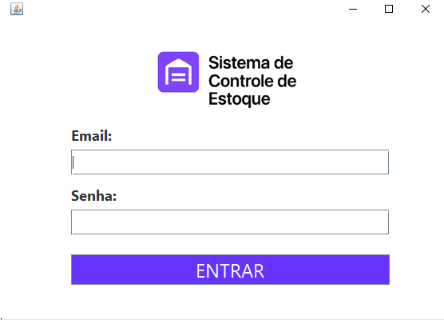
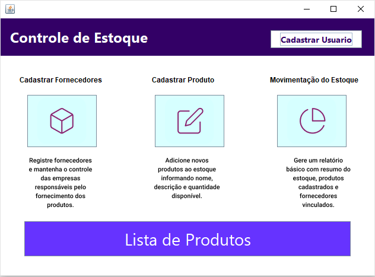
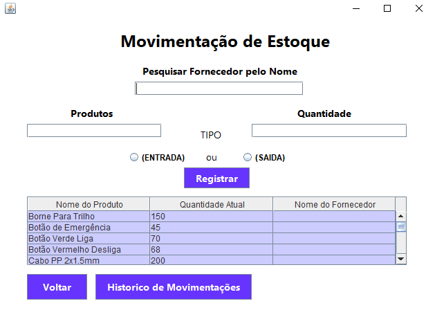
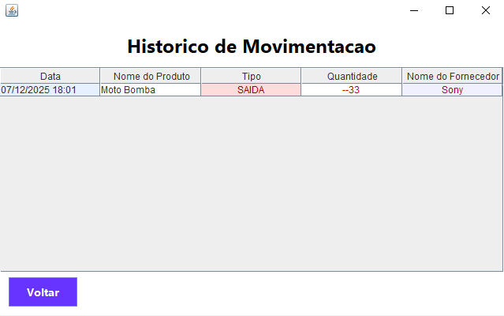
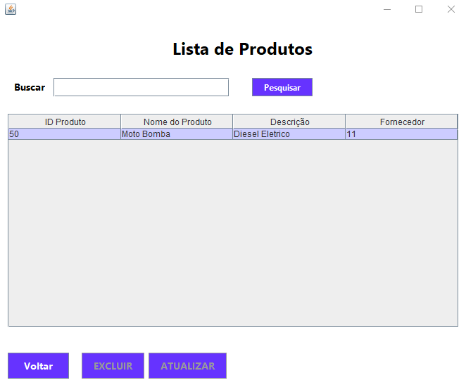

# Sistema de Controle de Estoque

## Sobre o Projeto

Este projeto foi desenvolvido durante o curso Técnico em Desenvolvimento de Software do Senac como parte das atividades práticas e do Projeto Integrador.

O sistema tem como objetivo auxiliar no controle de estoque, permitindo o cadastro e a consulta de produtos e fornecedores, além do registro de movimentações de estoque. Os dados são armazenados em um banco de dados MySQL e acessados por meio de uma aplicação desktop desenvolvida em Java.

## Status do Projeto

O projeto não foi totalmente finalizado.

Algumas funcionalidades previstas inicialmente não puderam ser concluídas devido ao cronograma acadêmico e ao desenvolvimento simultâneo de outras unidades curriculares. Mesmo assim, as principais funcionalidades do sistema encontram-se implementadas e operacionais.

## Tecnologias Utilizadas

* Java
* Java Swing
* MySQL
* JDBC
* Git
* GitHub
* NetBeans IDE

## Funcionalidades Implementadas

* Sistema de login com níveis de acesso
* Leitura de credenciais através de arquivo TXT
* Cadastro de produtos
* Cadastro de fornecedores
* Consulta de produtos
* Consulta de fornecedores
* Controle de movimentação de estoque
* Histórico de movimentações
* Integração com banco de dados MySQL
* Organização do código utilizando DAO, Classes de Modelo e Views

## Telas do Sistema

### Login



### Dashboard



### Movimentação de Estoque



### Histórico de Movimentações



### Lista de Produtos



## Banco de Dados

Para executar o projeto é necessário criar um banco de dados chamado:

```sql
CREATE DATABASE controle_estoque;
```

Após a criação do banco, importe o arquivo SQL disponibilizado na pasta:

```text
banco/
```

Também é necessário adicionar ao projeto o driver JDBC do MySQL (`mysql-connector-j`) para que a aplicação consiga realizar a conexão com o banco de dados.

## Usuários para Teste

Os usuários abaixo foram criados apenas para fins acadêmicos e demonstração das funcionalidades do sistema:

| Perfil        | Senha |
| ------------- | ----- |
| Administrador | 123   |
| Operador      | 123   |
| Usuário       | 123   |

As informações de login também estão disponíveis na pasta:

```text
docs/
```

## Estrutura do Projeto

```text
banco/
docs/
screenshots/
src/
├── classes
├── dao
├── conexao
└── view
```

## Observações

Existe um conjunto adicional de telas relacionadas à exclusão de registros. Essas funcionalidades não foram concluídas devido a dificuldades encontradas durante a implementação e ao prazo disponível para desenvolvimento do projeto.

Este sistema foi desenvolvido com finalidade educacional para aplicação prática dos conhecimentos adquiridos durante o curso Técnico em Desenvolvimento de Software do Senac.

## Autor

Matheus Silva Melo
